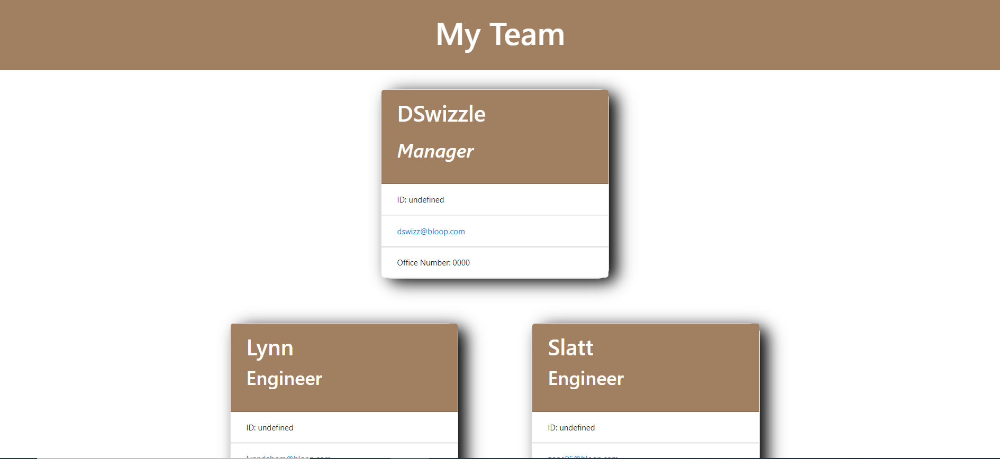

# Team Profile Builder
  
      https://opensource.org/licenses/MIT

  ## Description

  An application that utilizes Nodejs to take in a manager's input to generate a developer team consisting of engineers and/or interns.

  ## Table of Contents

  * [Installation](#installation)

  * [Usage](#usage)

  * [License](#License)

  * [Contributing](#contributing)

  * [Tests](#tests)

  * [Questions](#Questions)

  ## Installation
  
  To install necessary dependencies run the following command:

  ```
  npm i
  ```

  ## Usage

  The following image demonstrates the application's output.
  

  ## License

  This project is licensed under the MIT license.

  ## Contributing

  NA

  ## Tests

  To run tests, run the following command:

  ```
  npm test
  ```

  ## Questions

  If you have any questions about the repo, open an issue or contact me directly at dasiasmith023@gmail.com. You can find more of my work
  at .

